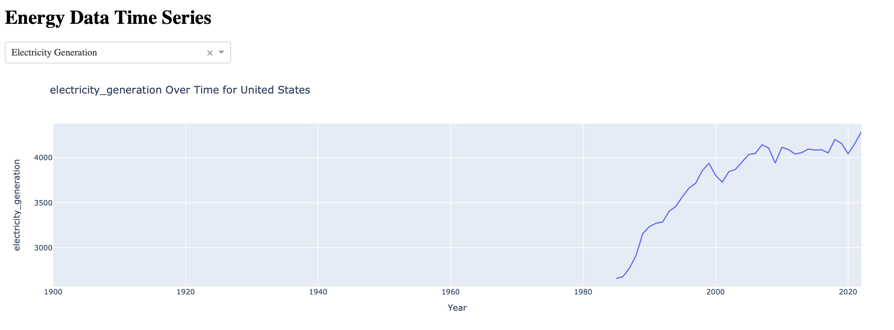

# Data Query

## Description

**Step 1**

This section describes the data query and data analysis process.

The data was downloaded from Our World in Data, a scientific online publication focusing on large global problems such as poverty, disease, hunger, climate change, war, existential risks, and inequality (Roser, n.d.). This specific dataset was found under the topic of [Energy](https://ourworldindata.org/energy). The following is the description of the page:

> The world lacks a safe, low-carbon, and cheap large-scale energy infrastructure.
>
> Until we scale up such an energy infrastructure, the world will continue to face two energy problems: hundreds of millions of people lack access to sufficient energy, and the dominance of fossil fuels in our energy system drives climate change and other health impacts such as air pollution.
>
> To ensure everyone has access to clean and safe energy, we need to understand energy consumption and its impacts around the world today and how this has changed over time.
>
> On this page, you can find all our data, visualizations, and writing relating to energy. 
(Rosado, et.al, 2023)

  <kbd>
    
  </kbd>

*Image created by OWID*

**Step 2**

All code from Our World in Data is open-sourced under the MIT license and can be found on GitHub. Thus, I downloaded the data and codebook directly from their official [Github repository](https://github.com/owid/energy-data/blob/master/README.md). 

  <kbd>
    
  </kbd>

*Image created by OWID*

The data downloaded was already orginized in a CSV file.

**Step 3**

Looking at the data in the csv file, it is clear that the data needs to be cleaned to remove null values focusing on the research question at hand. For this, the plan is to use python libraries such as Pandas. 

# Data Visualization

### Visualization 1
The data visualization was done using the dash app. This [file](app1.py) contians the code to run the interactive plot of a Time Series analysis of Energy Production including, total electricity generation, from fossil fuels, and from renewables. Below are the static plots of these variables throughout time for the US. The reason why only teh US is shown is because there are a lot of locations repreesnted in the dataset and the visualization of only one major power is enough to get an idea of waht the raw data shows. To interact with the plot, run the code on your local computer. Alternatively, go to this [Google Colab](https://colab.research.google.com/drive/1danKQTxQ5RsbSFg-0PJWhEhdRlR1jZqT?usp=sharing) to interact with the plot.

Variables: electricity_generation, renewables_electricity, and fossil_electricity, year, country = US

  <kbd>
    
  </kbd>

*Figure 1: Electricity produced in the US by Fossil Fuels thourhgout time. Image created with Dash app*

  <kbd>
    
  </kbd>

*Figure 2: Electricity produced in the US by Renewable sources throughout time. Image created with Dash app*

  <kbd>
    
  </kbd>

*Figure 3: Total Electricity produced in the US throughout time. Image created with Dash app*

### Visualization 2
This [file](app2.py) contians the code to run the interactive plot of a Global Distribution Choropleth Map that explores how different countries contribute to energy production. Alternatively, go to this [Google Colab](https://colab.research.google.com/drive/1xJ69o6yf3ww4jucHsBnAQGiYUPdj1jWc?usp=sharing) to interact with the plot.

Variables: country, population, electricity_generation

  <kbd>
    
  </kbd>

*Figure 4: Total Electricity produced in different countries. Image created with Dash app*

### Visualization 3
This [file](app3.py) contians the code to run the interactive plot of Anomaly Detection to identify anomalies or changes in energy consumption patterns. Alternatively, go to this [Google Colab](https://colab.research.google.com/drive/1SSkIpLYBewnOZaXM9qjeW7d6ijQCQej6?usp=sharing) to interact with the plot.

Variables: energy_cons_change_pct, renewables_cons_change_pct, countries, year

  <kbd>
    
  </kbd>

*Figure 5: Energy Consumption Change Percentage. Image created with Dash app*

  <kbd>
    
  </kbd>

*Figure 6: Renewables Consumption Change Percentage. Image created with Dash app*

# Data Query Process (pseudo-code)

## 1. Data Collection:

- **Download Dataset from Our World in Data:**
  - The primary dataset is sourced from Our World in Data, available [here](https://ourworldindata.org/energy).
  - Use the provided link to download the dataset for analysis.

## 2. Exploratory Data Analysis:

- **Understand Dataset Structure:**
  - Examine the dataset columns and their descriptions to gain insights into available variables.
  
- **Data Cleaning and Preprocessing:**
  - Address any missing or inconsistent data.
  - Filter only the necessary variables for analysis.
  
## 3. Data Visualization:

- **Visualizing Energy Patterns:**
  - Utilize Python data visualization libraries like Plotly and Dash for creating interactive visualizations.
  - Create time series plots for electricity generation, renewables electricity, and fossil electricity.
  - Explore the energy consumption patterns over time.

- **Global Distribution Maps:**
  - Develop choropleth maps to showcase the contribution of different countries to energy consumption, production, and anomalies.
  - Visualize variables such as population, electricity generation, etc., on a global scale.

- **Anomaly Detection Plots:**
  - Identify anomalies or changes in energy consumption patterns.
  - Create line plots for variables like energy consumption change percentage and renewables consumption change percentage.

## 4. Dash App Implementation:

- **Time Series Plot Component:**
  - Implement a Dash app with a time series plot.
  - Include a dash component that allows users to switch between electricity generation, renewables electricity, and fossil electricity.

- **Global Distribution Maps Component:**
  - Extend the Dash app to include global distribution maps.
  - Allow users to explore contributions to energy consumption, production, and anomalies by different countries.

- **Anomaly Detection Plots Component:**
  - Enhance the Dash app with anomaly detection line plots.
  - Enable users to identify and analyze anomalies or changes in energy consumption patterns.

## 5. Interactivity and Filtering:

- **Refine Visualizations for Readability:**
  - Analyze the visualizations and ensure they effectively communicate insights.
  - Consider filtering data or adjusting plot scales for better readability.
  
## 6. Embed in Readme.md:

- **Update Readme.md:**
  - Embed the visualizations and Dash app in your Readme.md to provide an overview of your research and insights.

## Data Query flowchart

  <kbd>
    
  </kbd>

*Figure 1: Data Query and visualization process flowchart. Created with Whimsical*

### Justification for Dataset Selection

The selection of the OWID Energy Dataset is based on several considerations that align with the research objectives. Our World in Data is a reputable scientific online platform known for providing comprehensive and reliable datasets on global issues, including energy dynamics. The dataset contains a rich collection of variables related to energy consumption, production, and environmental impact, making it well-suited for investigating the impact of external factors on energy anomalies (Rosado et al., 2023).

The OWID Energy Dataset includes relevant variables such as GDP, biofuel consumption, coal usage, gas consumption, nuclear power, oil consumption, hydropower, low-carbon energy, renewables, and others (Rosado et al., 2023). These variables align with the economic indicators, policy changes, and global events outlined in the research questions. Moreover, the dataset provides a comprehensive overview of global energy dynamics, offering a holistic view of the energy landscape. This aligns with the research's goal of understanding the influence of external factors on anomalies in energy consumption and production.

## References

Rosado, Pablo., Ritchie, Hannah., and Roser, Max. 2023. "Energy." OurWorldInData.org. Retrieved from 'https://ourworldindata.org/energy' [Online Resource].