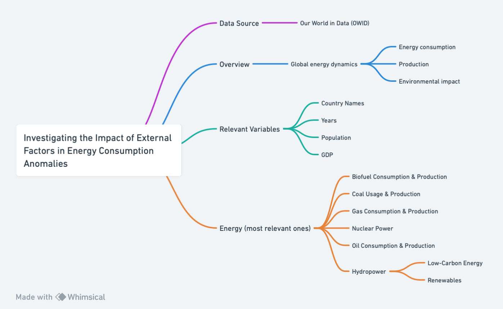

# Dataset Description

## Introduction

The dataset provides an overview of global energy dynamics. It shows different variables related to energy consumption, production, and environmental impact. For example, the names of several countries across the world,the year the data was recorded for that particular country, population, GDP, biofuel consumption, coal usage, gas consumption, nuclear power, oil consumption, hydropower, low-carbon energy, renewables (solar and wind power), and electricity generation. The dataset also describes diverse metrics such as per capita measures, annual changes, and percentage shares, offering valuable insights in the global use energy. As the OWID site explains, the "complete Energy dataset is a collection of key metrics maintained by Our World in Data. It is updated regularly and includes data on energy consumption (primary energy, per capita, and growth rates), energy mix, electricity mix and other relevant metrics" (Rosado et.al, 2023).

## Data Dictionary

Detailed description of each variable in the dataset. 

| Variable Name                     | Description                                      | Frequency     | Unit                   | Type                    |
| --------------------------------- | ------------------------------------------------ | ------------- | ---------------------- | ----------------------- |
| country                           | Geographic location                             | -             | -                      | String                 |
| year                              | Year of observation                             | Annual        | -                      | Integer                |
| iso_code                          | ISO 3166-1 alpha-3 three-letter country codes    | -             | -                      | String                 |
| population                        | Population by country                           | Annual        | Persons                | Integer                |
| gdp                               | Gross domestic product                           | Annual        | International-$ in 2011 prices| Numeric             |
| biofuel_cons_change_pct           | Annual percentage change in biofuel consumption | Annual        | Percentage             | Numeric                |
| biofuel_cons_change_twh           | Annual change in biofuel consumption (TWh)      | Annual        | Terawatt-hour          | Numeric                |
| biofuel_cons_per_capita           | Biofuel consumption per capita                  | Annual        | Kilowatt-hour per person| Numeric                |
| biofuel_consumption               | Primary energy consumption from biofuels        | Annual        | Terawatt-hour          | Numeric                |
| biofuel_elec_per_capita           | Electricity generation from bioenergy per person| Annual        | Kilowatt-hour per person| Numeric                |
| biofuel_electricity               | Electricity generation from bioenergy           | Annual        | Terawatt-hour          | Numeric                |
| biofuel_share_elec                | Share of electricity from bioenergy             | Annual        | Percentage             | Numeric                |
| biofuel_share_energy              | Share of primary energy from biofuels           | Annual        | Percentage             | Numeric                |
| carbon_intensity_elec             | Carbon intensity of electricity                 | Annual        | Grams CO₂ equivalents per kilowatt-hour| Numeric  |
| coal_cons_change_pct              | Annual percentage change in coal consumption    | Annual        | Percentage             | Numeric                |
| coal_cons_change_twh              | Annual change in coal consumption (TWh)         | Annual        | Terawatt-hour          | Numeric                |
| coal_cons_per_capita              | Coal consumption per capita                    | Annual        | Kilowatt-hour per person| Numeric                |
| coal_consumption                  | Primary energy consumption from coal            | Annual        | Terawatt-hour          | Numeric                |
| coal_elec_per_capita              | Electricity generation from coal per person     | Annual        | Kilowatt-hour per person| Numeric                |
| coal_electricity                  | Electricity generation from coal                | Annual        | Terawatt-hour          | Numeric                |
| coal_prod_change_pct              | Annual percentage change in coal production     | Annual        | Percentage             | Numeric                |
| coal_prod_change_twh              | Annual change in coal production (TWh)          | Annual        | Terawatt-hour          | Numeric                |
| coal_prod_per_capita              | Coal production per capita                      | Annual        | Kilowatt-hour per capita| Numeric                |
| coal_production                   | Coal production                                  | Annual        | Terawatt-hour          | Numeric                |
| coal_share_elec                   | Share of electricity from coal                  | Annual        | Percentage             | Numeric                |
| coal_share_energy                 | Share of primary energy from coal               | Annual        | Percentage             | Numeric                |
| electricity_demand                | Total electricity demand                       | Annual        | Terawatt-hour          | Numeric                |
| electricity_generation            | Total electricity generation                   | Annual        | Terawatt-hour          | Numeric                |
| electricity_share_energy          | Electricity share in total energy               | Annual        | Percentage             | Numeric                |
| energy_cons_change_pct            | Annual percentage change in total energy consumption| Annual     | Percentage             | Numeric                |
| energy_cons_change_twh            | Annual change in total energy consumption (TWh) | Annual        | Terawatt-hour          | Numeric                |
| energy_per_capita                 | Primary energy consumption per capita           | Annual        | Kilowatt-hour per person| Numeric                |
| energy_per_gdp                    | Primary energy consumption per GDP              | Annual        | Kilowatt-hour per International-$| Numeric        |
| fossil_cons_change_pct            | Annual percentage change in fossil fuel consumption| Annual   | Percentage             | Numeric                |
| fossil_cons_change_twh            | Annual change in fossil fuel consumption (TWh)  | Annual        | Terawatt-hour          | Numeric                |
| fossil_elec_per_capita            | Electricity generation from fossil fuels per person| Annual| Kilowatt-hour per person| Numeric                |
| fossil_electricity                | Electricity generation from fossil fuels        | Annual        | Terawatt-hour          | Numeric                |
| fossil_energy_per_capita           | Primary energy consumption from fossil fuels per capita| Annual| Kilowatt-hour per person| Numeric           |
| fossil_fuel_consumption           | Total fossil fuel consumption                   | Annual        | Terawatt-hour          | Numeric                |
| fossil_share_elec                 | Share of electricity from fossil fuels          | Annual        | Percentage             | Numeric                |
| fossil_share_energy               | Share of primary energy from fossil fuels       | Annual        | Percentage             | Numeric                |
| gas_cons_change_pct               | Annual percentage change in gas consumption    | Annual        | Percentage             | Numeric                |
| gas_cons_change_twh               | Annual change in gas consumption (TWh)         | Annual        | Terawatt-hour          | Numeric                |
| gas_consumption                   | Total gas consumption                           | Annual        | Terawatt-hour          | Numeric                |
| gas_elec_per_capita               | Electricity generation from gas per person      | Annual        | Kilowatt-hour per person| Numeric                |
| gas_electricity                   | Electricity generation from gas                | Annual        | Terawatt-hour          | Numeric                |
| gas_energy_per_capita              | Primary energy consumption from gas per capita | Annual        | Kilowatt-hour per person| Numeric                |
| gas_prod_change_pct               | Annual percentage change in gas production     | Annual        | Percentage             | Numeric                |
| gas_prod_change_twh               | Annual change in gas production (TWh)          | Annual        | Terawatt-hour          | Numeric                |
| gas_prod_per_capita               | Gas production per capita                       | Annual        | Kilowatt-hour per capita| Numeric                |
| gas_production                    | Total gas production                            | Annual        | Terawatt-hour          | Numeric                |
| gas_share_elec                    | Share of electricity from gas                   | Annual        | Percentage             | Numeric                |
| gas_share_energy                  | Share of primary energy from gas                | Annual        | Percentage             | Numeric                |
| emissions_elec_generation         | Emissions from electricity generation          | Annual        | Million tonnes CO₂ equivalents| Numeric          |
| hydropower_cons_change_pct        | Annual percentage change in hydropower consumption| Annual   | Percentage             | Numeric                |
| hydropower_cons_change_twh        | Annual change in hydropower consumption (TWh)  | Annual        | Terawatt-hour          | Numeric                |
| hydropower_cons_per_capita        | Primary energy consumption from hydropower per capita| Annual| Kilowatt-hour per person| Numeric           |
| hydropower_elec_per_capita        | Electricity generation from hydropower per person| Annual| Kilowatt-hour per person| Numeric           |
| hydropower_electricity            | Electricity generation from hydropower         | Annual        | Terawatt-hour          | Numeric                |
| hydropower_share_elec             | Share of electricity from hydropower           | Annual        | Percentage             | Numeric                |
| hydropower_share_energy           | Share of primary energy from hydropower        | Annual        | Percentage             | Numeric                |
| low_carbon_cons_change_pct        | Annual percentage change in low-carbon energy consumption| Annual| Percentage       | Numeric                |
| low_carbon_cons_change_twh        | Annual change in low-carbon energy consumption (TWh)| Annual   | Terawatt-hour       | Numeric           |
| low_carbon_cons_per_capita        | Primary energy consumption from low-carbon sources per capita| Annual| Kilowatt-hour per person| Numeric    |
| low_carbon_elec_per_capita        | Electricity generation from low-carbon sources per person| Annual| Kilowatt-hour per person| Numeric    |
| low_carbon_electricity            | Electricity generation from low-carbon sources | Annual        | Terawatt-hour          | Numeric                |
| low_carbon_share_elec             | Share of electricity from low-carbon sources   | Annual        | Percentage             | Numeric                |
| low_carbon_share_energy           | Share of primary energy from low-carbon sources| Annual        | Percentage             | Numeric                |
| net_elec_imports                  | Net electricity imports                         | Annual        | Terawatt-hour          | Numeric                |
| net_imports_share_demand           | Net electricity imports as a share of demand    | Annual        | Percentage             | Numeric                |
| nuclear_cons_change_pct           | Annual percentage change in nuclear power consumption| Annual| Percentage             | Numeric           |
| nuclear_cons_change_twh           | Annual change in nuclear power consumption (TWh)| Annual       | Terawatt-hour          | Numeric                |
| nuclear_cons_per_capita           | Primary energy consumption from nuclear power per capita| Annual| Kilowatt-hour per person| Numeric     |
| nuclear_elec_per_capita           | Electricity generation from nuclear power per person| Annual| Kilowatt-hour per person| Numeric     |
| nuclear_electricity               | Electricity generation from nuclear power      | Annual        | Terawatt-hour          | Numeric                |
| nuclear_share_elec                | Share of electricity from nuclear power        | Annual        | Percentage             | Numeric                |
| nuclear_share_energy              | Share of primary energy from nuclear power     | Annual        | Percentage             | Numeric                |
| oil_cons_change_pct               | Annual percentage change in oil consumption    | Annual        | Percentage             | Numeric                |
| oil_cons_change_twh               | Annual change in oil consumption (TWh)         | Annual        | Terawatt-hour          | Numeric                |
| oil_cons_per_capita               | Primary energy consumption from oil per capita | Annual        | Kilowatt-hour per person| Numeric                |
| oil_elec_per_capita               | Electricity generation from oil per person     | Annual        | Kilowatt-hour per person| Numeric                |
| oil_electricity                   | Electricity generation from oil                | Annual        | Terawatt-hour          | Numeric                |
| oil_production_per_capita         | Oil production per capita                       | Annual        | Kilowatt-hour per capita| Numeric                |
| oil_production                    | Oil production                                   | Annual        | Terawatt-hour          | Numeric                |
| oil_share_elec                    | Share of electricity from oil                   | Annual        | Percentage             | Numeric                |
| oil_share_energy                  | Share of primary energy from oil                | Annual        | Percentage             | Numeric                |
| renewables_cons                   | Primary energy consumption from other renewables| Annual        | Terawatt-hour          | Numeric                |
| renewables_elec                   | Electricity generation from other renewables, including bioenergy| Annual| Terawatt-hour| Numeric                |
| renewables_elec_excl_bio          | Electricity generation from other renewables, excluding bioenergy| Annual| Terawatt-hour| Numeric                |
| renewables_cons_change_pct        | Annual percentage change in renewables consumption| Annual     | Percentage             | Numeric                |
| renewables_cons_change_twh        | Annual change in renewables consumption (TWh) | Annual        | Terawatt-hour          | Numeric                |
| renewables_per_capita             | Primary energy consumption from renewables per capita| Annual| Kilowatt-hour per person| Numeric          |
| renewables_elec_per_capita        | Electricity generation from renewables per person| Annual| Kilowatt-hour per person| Numeric          |
| renewables_electricity            | Electricity generation from renewables         | Annual        | Terawatt-hour          | Numeric                |
| renewables_share_elec             | Share of electricity from renewables           | Annual        | Percentage             | Numeric                |
| renewables_share_energy           | Share of primary energy from renewables        | Annual        | Percentage             | Numeric                |
| solar_cons_change_pct             | Annual percentage change in solar power consumption| Annual    | Percentage             | Numeric                |
| solar_cons_change_twh      | Annual change in solar power consumption                    | -         | terawatt-hours  | Input-equivalent    |
| solar_consumption           | Primary energy consumption from solar power                  | Annual    | terawatt-hours  | Measured            |
| solar_elec_per_capita       | Electricity generation from solar power per person           | -         | kilowatt-hours  | Measured            |
| solar_electricity           | Electricity generation from solar power                      | Annual    | terawatt-hours  | Measured            |
| solar_energy_per_capita     | Solar power consumption per capita                           | -         | kilowatt-hours  | Measured            |
| solar_share_elec            | Share of electricity from solar power                         | -         | %               | Measured            |
| solar_share_energy          | Share of primary energy consumption from solar power         | -         | %               | Measured            |
| wind_cons_change_pct        | Annual percentage change in wind power consumption           | -         | %               | Input-equivalent    |
| wind_cons_change_twh        | Annual change in wind power consumption                      | -         | terawatt-hours  | Input-equivalent    |
| wind_consumption            | Primary energy consumption from wind power                   | Annual    | terawatt-hours  | Measured            |
| wind_elec_per_capita        | Electricity generation from wind power per person            | -         | kilowatt-hours  | Measured            |
| wind_electricity            | Electricity generation from wind power                       | Annual    | terawatt-hours  | Measured            |
| wind_energy_per_capita      | Wind power consumption per capita                            | -         | kilowatt-hours  | Measured            |
| wind_share_elec             | Share of electricity from wind power                          | -         | %               | Measured            |
| wind_share_energy           | Share of primary energy consumption from wind power          | -         | %               | Measured            |

## Dataset Information - [owed-energy-data.csv](owid-energy-data.csv)

### Data Source
The primary dataset utilized for this research is sourced from Our World in Data (OWID) [OWID Energy Dataset](owid-energy-data.csv).

### Justification for Dataset Selection

The selection of the OWID Energy Dataset is based on several considerations that align with the research objectives. Our World in Data is a reputable scientific online platform known for providing comprehensive and reliable datasets on global issues, including energy dynamics. The dataset contains a rich collection of variables related to energy consumption, production, and environmental impact, making it well-suited for investigating the impact of external factors on energy anomalies (Rosado et al., 2023).

The OWID Energy Dataset includes relevant variables such as GDP, biofuel consumption, coal usage, gas consumption, nuclear power, oil consumption, hydropower, low-carbon energy, renewables, and others (Rosado et al., 2023). These variables align with the economic indicators, policy changes, and global events outlined in the research questions (Coolgeography, n.d.). Moreover, the dataset provides a comprehensive overview of global energy dynamics, offering a holistic view of the energy landscape. This aligns with the research's goal of understanding the influence of external factors on anomalies in energy consumption and production 

## Dataset Structure

### Overview
The dataset includes various variables related to global energy dynamics, providing insights into energy consumption, production, and environmental impact.

  <kbd>
    
  </kbd>

*Figure 1: Data structure flowchart. Created with Whimsical*

## References

Coolgeography. "Energy - Factors Affecting Energy Supply." n.d. https://www.coolgeography.co.uk/gcsen/CRM_Energy_Factors_Supply.php.

Rosado, Pablo., Ritchie, Hannah., and Roser, Max. 2023. "Energy." OurWorldInData.org. Retrieved from 'https://ourworldindata.org/energy' [Online Resource].

