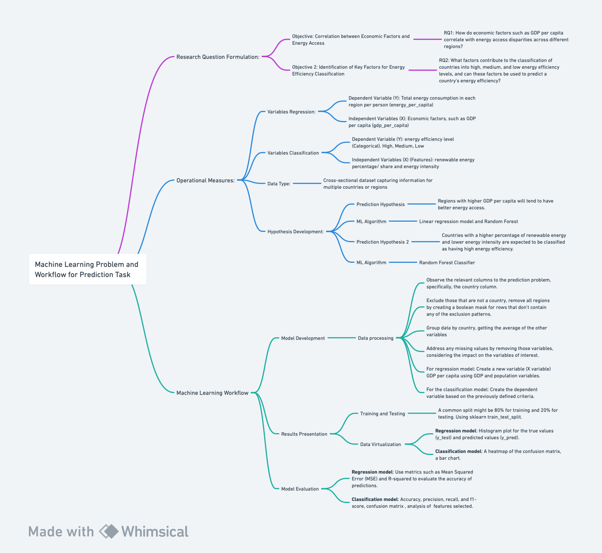

## 1.1. The Prediction Problem

## Prediction Task Workflow 

  <kbd>
    
  </kbd>

*Figure 1: Flowchart  of the task and workflow. Created with Whimsical* 

## Research Question Formulation:

### Objective:
Correlation between Economic Factors and Energy Access

### RQ1: 
How do economic factors such as GDP per capita correlate with energy access disparities across different regions?

#### Significance:  
Energy access is related to economic development, and understanding the correlation with economic factors is essential for formulating targeted interventions. Thus, examining the relationship between GDPs per capita with energy access disparities helps policymakers and researchers identify key drivers of inequality. This knowledge can inform policy decisions, focusing on inclusive economic growth and urban planning that considers energy access as an integral component. For example, in their article, "Inclusive Economic Growth: Relationship between Energy and Governance Efficiency" (2023), researchers Aleksy Kwilinski, Oleksii Lyulyov, and Tetyana Pimonenko argue that as the European Union (EU) is striving for carbon neutrality while promoting inclusive economic growth, to achieve this goal they need to implement effective incentives and initiatives. They aregue that "energy sectors are the core determinant of inclusive economic growth", as traditional energy resources (coal) have a higher negative impact on nature and people’s well-being than on economic and social benefits (Kwilinski et.al, 2023). 

### Objective 2: 
The objective of this second model is to identify and understand the key factors that contribute to the classification of countries into high, medium, and low energy efficiency levels.

### RQ2: 
What factors contribute to the classification of countries into high, medium, and low energy efficiency levels, and can these factors be used to predict a country's energy efficiency?
#### Significance:  
The primary aim is to develop a predictive model that leverages these factors to predict a country's energy efficiency classification accurately. The need for such research is connected to what was previously explained of the determining which regions have lower efficiency levels and the reason as to why that is, could also encourage the development and implementation of effective incentives and initiative that lead to such "inclusive economic growth"(Kwilinski et.al, 2023). Look at *Figure 1* for a detailed flowchart of this workflow, providing an overview of the task.

## Operational Measures:

### Variables:

- **Dependent Variable (Y):** 
  Total energy consumption in each region per person (`energy_per_capita`).
  
- **Independent Variables (X):** 
  Economic factors, such as GDP per capita (`gdp_per_capita`).
  
- **Data Type:** 
  The dataset is a cross-sectional dataset that captures information for multiple countries or regions.

### Variables 2:

- **Dependent Variable (Y):** 
  Energy efficiency level (Categorical). High, Medium, Low (This variable is created based on a researched cutting point for the levels of energy, more on this later).
  
- **Independent Variables (X) (Features):** 
  - Renewable energy percentage/share (`renewables_share_elec`): Percentage of total energy derived from renewable sources.
  - Energy intensity (`energy_per_gdp`): Energy consumption per unit of GDP, indicating the efficiency of energy use in the economy.
  
#### Hypothesis Development:

**Prediction Hypothesis:** 
Regions with higher GDP per capita will tend to have better energy access, while those with lower economic indicators may face greater energy access disparities.

- **Justification:** 
This hypothesis is grounded in the idea that economic development, as indicated by higher GDP per capita tends to be associated with improved infrastructure and energy access. Wealthier and more developed regions may have the resources to invest in energy infrastructure, reducing disparities in access. Professor Kelsey Jack, of the University of California at Santa Barbara at a Conference organized by the World Bank and the International Growth Centre on March 3rd-4th 2022, explains that energy is closely intertwined with economic development. She highlights a supposed correlation between higher GDP levels and increased electricity usage, access, reliability, and affordability. Although researchers grapple with understanding the causal relationship between economic growth and energy, it's evident that development cannot occur without heightened energy consumption. She illustrates this point with historical evidence in which, before the industrial revolution, economies relied on limited organic energy sources like firewood and manpower. The adoption of coal as an energy source due to innovation and technological advancements unlocked greater production possibilities, spurring exponential economic growth (Jack, 2022). 

**Machine Learning Algorithm Selection:** 
The goal is to predict or understand relationships between variables, a linear regression model would be appropriate. 

- **Justification:** 
Regression models provide interpretability to understand the impact of each independent variable on the dependent variable. Given that the relationships between variables may not be highly complex, linear regression or decision trees are appropriate. Regression models can provide insights into the direction and strength of relationships, helping to answer the research questions effectively. Thus, the algorithms chosen are linear regression and random forest.

**Prediction Hypothesis 2:** 
The combination of renewable energy share (`renewables_share_elec`) and energy intensity (`energy_per_gdp`) can predict the classification of countries into high, medium, and low energy efficiency levels. Specifically, countries with a higher percentage of renewable energy and lower energy intensity are expected to be classified as having high energy efficiency. 

- **Justification:** 

As a research article titled "Sustainable economic performance and transition towards cleaner energy to mitigate climate change risk: evidence from top emerging economies" Bin He, Xiang Ma, Muhammad Nasir Malik, Riazullah Shinwari, Yaode Wang, Lingli Qing, Abd Alwahed Dagestani, and Mohammed Moosa Ageli discusses, there is a link between energy efficiency and energy transition. The study aims to investigate the link between energy efficiency and energy transition, suggesting a focus on renewable energy sources. The primary finding of the study are that energy efficiency has the largest influence on the energy transition, which reinforces the importance of energy efficiency in determining a country's energy profile. Additionally, the findings regarding the influence of GDP and other control variables provide further insights into factors that may affect energy efficiency levels (He et.al, 2022).

  - Renewable Energy Percentage (X1): Countries with a higher percentage of energy derived from renewable sources are likely to have cleaner and more sustainable energy profiles, contributing positively to their energy efficiency levels. Renewable energy sources are inherently more environmentally friendly and align with global sustainability goals (Zabat et al., 2022).
  - Energy Intensity (X2): Energy intensity, representing the amount of energy consumed per unit of GDP, is a key indicator of energy efficiency. Lower energy intensity implies that a country canachieve economic output with less energy consumption, reflecting a more efficient use of energy resources (Aydın and Esen, 2018).
  - Energy Efficiency Level (Y): The classification into high, medium, and low energy efficiency levels provides a meaningful and actionable categorization. It allows for a practical understanding of a country's energy performance and can guide targeted interventions to improve efficiency. The cutoff points for this variable are based on an article titled, "Does the level of energy intensity matter in the effect of energy consumption on the growth of transition economies? Evidence from dynamic panel threshold analysis" (Aydin and Esen, 2018).The article defines energy intensity as the measure of energy use efficiency of an economy in the production process. It refers to the amount of energy consumed to generate one unit of income, with lower energy intensity indicating more efficient use of energy. The main objective of the article is the possibility of a non-linear relationship between energy consumption and economic growth, suggesting that there may be a threshold level for energy consumption beyond which its effect on economic growth becomes negative or insignificant. Does, indicating that whilst there is a threshold, the one used in the reaserch presented in this github, a more extensive literature review should be done to determine whether this threshold of classification is accurate. For the purposes of this research, to explore ML classification models, this threshold will be used, however, for policy implementation, an extensive validation of this threshold would have to be performed. 

**Machine Learning Algorithm Selection 2:** 
Using a random forest classifier to test the hypothesis.

- **Justification:** 
Categorical model. Random Forests are capable of capturing complex, non-linear relationships between input features and the target variable. Since the relationship between renewable energy percentage, energy intensity, and energy efficiency levels may not be linear, a Random Forest is well-suited for this task. Random Forests offer a built-in feature importance analysis, allowing us to understand the contribution of each variable to the classification. This aligns with the goal of identifying key factors influencing energy efficiency levels.

## 1.2. The Machine Learning Workflow

## Model Development:

The following workflow was the same for both regression and classification models, for details on how they differed, go to detailed code on both models:
- Regression Model
  - [Processing](./code/data_analysis/Data_Processing_Regression.ipynb)
  - [Analysis](./code/data_analysis/Data_Analysis_Regression.ipynb)
- [Classification Model](./code/data_analysis/Analysis_Processing_Classification.ipynb)

### Data Processing:

- Observe the relevant columns to the prediction problem, specifically, the country column.
- Exclude those that are not a country, remove all regions by creating a boolean mask for rows that don't contain any of the exclusion patterns.
- Group data by country, getting the average of the other variables.
- Address any missing values by removing those variables, considering the impact on the variables of interest.
- **For regression model:** Create a new variable (X variable) GDP per capita using GDP and population variables.
- **For the classification model:** Create the dependent variable based on the previously defined criteria (Using the threshold retrieved from the article (Aydin and Esen, 2018)).

### Results Presentation:

- **Training and Testing:** Split the dataset into training and testing sets. A common split might be 80% for training and 20% for testing. Using sklearn train_test_split.
- **Data Visualization:** 
  - **Regression model:** Histogram plot for the true values (`y_test`) and predicted values (`y_pred`).
  - **Classification model:** A heatmap of the confusion matrix will be used to showcase the model's performance in classifying countries into high, medium, and low energy efficiency levels. A bar chart or plot will be generated to illustrate the relative importance of the input features (renewable energy percentage and energy intensity) in making classification decisions.

### Model Evaluation:

- **Evaluation Criteria:** 
  - **Regression model:** Use metrics such as Mean Squared Error (MSE) and R-squared to evaluate the accuracy of predictions.
  - **Classification model:** Use metrics such as accuracy for the overall correctness of the model's predictions. Precision, recall, and f1-score will be used to evaluate the model's performance for each class (high, medium, low) individually. A detailed confusion matrix will provide insights into false positives, false negatives, true positives, and true negatives. An analysis of the features selected to understand the contribution of each feature to the model's decisions.
- **Iterative Improvement:** 
  - **Hyperparameter Tuning:** Adjust model hyperparameters to find the optimal configuration using techniques like grid search or random search.
  - **Feature Selection:** Reassess feature importance and consider removing irrelevant or highly correlated features.
  - **Model Complexity:** Evaluate if the model is overfitting or underfitting and adjust complexity accordingly.
  - **Include Additional Features:** If new relevant data becomes available, incorporate it to improve model accuracy, also to increase the data to train and test the model with.

## References:

- Aydın, Celil, and Ömer Esen. 2018. “Does the Level of Energy Intensity Matter in the Effect of Energy Consumption on the Growth of Transition Economies? Evidence from Dynamic Panel Threshold Analysis.” Energy Economics 69 (January): 185–95. [https://doi.org/10.1016/j.eneco.2017.11.010](https://doi.org/10.1016/j.eneco.2017.11.010).

- Bin He, Xiang Ma, Muhammad Nasir Malik, Riazullah Shinwari, Yaode Wang, Lingli Qing, Abd Alwahed Dagestani & Mohammed Moosa Ageli (2023) Sustainable economic performance and transition towards cleaner energy to mitigate climate change risk: evidence from top emerging economies, Economic Research-Ekonomska Istraživanja, 36:3, DOI: [10.1080/1331677X.2022.2154240](10.1080/1331677X.2022.2154240).

- Kelsey Jack. 2023. “How Much Do We Know About the Development Impacts of Energy Infrastructure?” World Bank Blogs (blog). [https://blogs.worldbank.org/energy/how-much-do-we-know-about-development-impacts-energy-infrastructure](https://blogs.worldbank.org/energy/how-much-do-we-know-about-development-impacts-energy-infrastructure).

- Kwilinski, Aleksy, Oleksii Lyulyov, and Tetyana Pimonenko. 2023. "Inclusive Economic Growth: Relationship between Energy and Governance Efficiency" Energies 16, no. 6: 2511. [https://doi.org/10.3390/en16062511](https://doi.org/10.3390/en16062511)

- “Measurements of Energy Access: A Better Way? - Energy for Growth Hub.” 2023. Energy for Growth Hub. June 12, 2023. [https://energyforgrowth.org/article/measurements-of-energy-access-a-better-way/](https://energyforgrowth.org/article/measurements-of-energy-access-a-better-way/).

- Zabat, Lotfi Hocine, Naima Akli Sadaoui, Abid Mehdi, and Habib Sekrafi. 2022. “Threshold Effects of Renewable Energy Consumption by Source in U.S. Economy.” Electric Power Systems Research 213 (December): 108669. [https://doi.org/10.1016/j.epsr.2022.108669](https://doi.org/10.1016/j.epsr.2022.108669).

